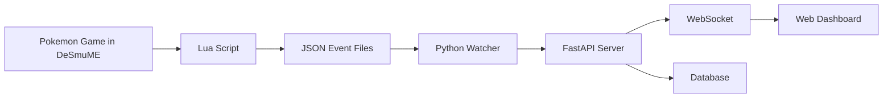

# SoulLink Tracker

**Real-time tracker for 3-player Pokemon SoulLink runs in Pokemon HeartGold/SoulSilver**

[](https://www.python.org/downloads/)
[](https://fastapi.tiangolo.com)
[](https://developer.mozilla.org/en-US/docs/Web/API/WebSockets_API)
[](https://pytest.org)

Automatically tracks Pokemon encounters, catches, faints, and soul links across multiple players in real-time using DeSmuME Lua scripts and a centralized web dashboard.

## 🎮 What is SoulLink?

**SoulLink** is a challenging Pokemon variant where 2-3 players play linked games:
- 🔗 Pokemon caught on the same route become "soul linked"
- 💀 If one linked Pokemon faints, **all linked Pokemon must be released**
- 🚫 **Dupes Clause**: Only first encounter of each species family counts
- 👥 **Species Clause**: Each player can only have one of each species family

## ✨ Features

- 🎯 **Automatic Detection**: DeSmuME Lua scripts detect encounters, catches, faints in real-time
- ⚡ **Real-time Updates**: WebSocket-based live dashboard for all players
- 🔗 **SoulLink Rules**: Automatically enforces dupes clause, species clause, soul link creation
- 🎣 **Full Encounter Support**: Grass, water, fishing, headbutt, rock smash encounters
- 🌟 **Shiny Detection**: Automatically flags shiny Pokemon
- 📊 **Web Dashboard**: Beautiful real-time monitoring interface
- 🔒 **Secure**: JWT authentication per player
- 🏠 **Easy Setup**: Automated setup scripts for quick start

## 🚀 Quick Start

### For Admins (Setting up the server)

**👑 If you're hosting the SoulLink run:**

1. **Download and run automated setup**:
   ```bash
   git clone https://github.com/your-repo/SoulLink_Tracker.git
   cd SoulLink_Tracker
   pip install -r requirements.txt
   python scripts/start_playtest.py
   ```

2. **Follow the comprehensive guide**: [**ADMIN_SETUP.md**](ADMIN_SETUP.md)

### For Players (Joining a run)

**🎮 If you're a player joining someone else's SoulLink:**

1. **Get your player info** from the admin (name, token, server address)
2. **Follow the player guide**: [**PLAYER_SETUP.md**](PLAYER_SETUP.md)

## 📋 What You Need

### System Requirements

- 🐍 **Python 3.9+** 
- 🎮 **DeSmuME** (0.9.11+ with Lua support)
- 📀 **Pokemon HeartGold/SoulSilver ROM** (preferably randomized)
- 🌐 **Internet connection** (for multi-player setups)

### For Players

- **Just your computer** with DeSmuME and Python
- **Configuration files** from your admin
- **5 minutes** to set up

### For Admins  

- **One computer** to run the central server
- **Network setup** (port forwarding or tunneling for remote players)
- **10 minutes** to set up everything

## 🎯 How It Works



1. **🎮 Play Pokemon** normally in DeSmuME
2. **📝 Lua script** automatically detects encounters, catches, faints
3. **🔄 Python watcher** sends events to central server
4. **⚡ Web dashboard** updates in real-time for all players
5. **🔗 Soul links** form automatically when players catch on same route

## 🌟 Screenshots

### Real-time Web Dashboard
- 📊 Run statistics (encounters, catches, faints, soul links)
- 👥 Player status and party information
- 📅 Live event feed with timestamps  
- 🔗 Soul link visualization
- ⚡ Real-time WebSocket updates

### DeSmuME Integration
- 🎯 Automatic encounter detection in all locations
- 🎣 Fishing, surfing, headbutt, rock smash support
- ✨ Shiny Pokemon detection
- 📍 Route and location tracking

## 📖 Documentation

### Setup Guides
- 🔧 [**Admin Setup Guide**](ADMIN_SETUP.md) - For hosting the server
- 🎮 [**Player Setup Guide**](PLAYER_SETUP.md) - For joining a run
- 🎯 [**Complete Playtest Guide**](PLAYTEST_GUIDE.md) - Comprehensive reference

### Technical Documentation
- 🏗️ [Architecture Overview](docs/ARCHITECTURE.md) (Coming soon)
- 📚 [API Reference](docs/API.md) (Auto-generated at `/docs`)
- 🧪 [Testing Guide](docs/TESTING.md) (Coming soon)
- 🚀 [Deployment Guide](docs/DEPLOYMENT.md) (Coming soon)

## 🛠️ Development

### Quick Development Setup

```bash
# Clone repository
git clone https://github.com/your-repo/SoulLink_Tracker.git
cd SoulLink_Tracker

# Install dependencies
pip install -r requirements.txt
pip install -r client/watcher/requirements.txt

# Initialize database
python scripts/init_database.py

# Start development server
uvicorn src.soullink_tracker.main:app --reload --host 127.0.0.1 --port 9000

# Run tests
python scripts/quick_test.py
```

### Project Structure

```
SoulLink_Tracker/
├── src/soullink_tracker/           # Main application
│   ├── api/                        # FastAPI endpoints
│   ├── auth/                       # JWT authentication
│   ├── core/                       # Business logic & rules
│   ├── db/                         # Database models
│   └── events/                     # WebSocket handling
├── client/                         # Client components
│   ├── lua/                        # DeSmuME Lua scripts
│   └── watcher/                    # Python event watchers
├── web/                           # Web dashboard
├── scripts/                       # Utility scripts
├── tests/                         # Test suite (115 tests)
└── data/                          # Reference data
```

### Testing

```bash
# Run all tests
pytest

# Run with coverage
pytest --cov=src --cov-report=html

# Health check
python scripts/health_check.py

# Quick functional test
python scripts/quick_test.py
```

### Development Philosophy

This project follows **Test-Driven Development (TDD)**:
- ✅ **115 unit tests** with 85.4% coverage
- ✅ **Integration tests** for API endpoints
- ✅ **End-to-end workflow testing**
- ✅ **Automated health checks**

## 🤝 Contributing

We welcome contributions! Here's how to help:

1. **🍴 Fork the repository**
2. **🌿 Create a feature branch** (`git checkout -b feature/amazing-feature`)
3. **✅ Write tests first** (TDD approach)
4. **💻 Implement your feature**
5. **🧪 Ensure all tests pass** (`pytest`)
6. **📝 Update documentation** if needed
7. **🚀 Submit a pull request**

### Code Style

- **Python**: Follow PEP 8, use type hints
- **JavaScript**: ES6+, consistent formatting
- **Tests**: Descriptive names, good coverage
- **Commits**: Clear, descriptive messages

## 🐛 Troubleshooting

### Common Issues

**"Lua script not working"**
- ✅ Ensure DeSmuME has Lua support
- ✅ Check ROM region matches config
- ✅ Verify output directory exists

**"Can't connect to server"**
- ✅ Check server is running: `curl http://SERVER:9000/health`
- ✅ Verify firewall/network settings
- ✅ Test with: `python scripts/health_check.py`

**"Events not appearing"**
- ✅ Check authentication token
- ✅ Verify player configuration
- ✅ Look at watcher logs for errors

### Getting Help

1. **📖 Check the setup guides** ([Admin](ADMIN_SETUP.md) | [Player](PLAYER_SETUP.md))
2. **🔍 Run diagnostics**: `python scripts/health_check.py`
3. **🧪 Test functionality**: `python scripts/quick_test.py`
4. **❓ Open an issue** with error details and system info

## 🎉 Success Stories

*"The real-time dashboard made our 3-player SoulLink run so much more engaging! Seeing soul links form instantly was amazing."* - Beta tester

*"Setup was surprisingly easy. The automated script just worked, and we were playing within 10 minutes."* - Admin feedback

*"Having automatic rule enforcement meant we could focus on playing instead of tracking spreadsheets."* - Player feedback

## 🗺️ Roadmap

### ✅ Completed (v1.0)
- Real-time encounter/catch/faint detection
- Web dashboard with live updates
- SoulLink rules enforcement
- JWT authentication system
- Comprehensive test suite

### 🔄 In Progress (v1.1)
- Mobile-responsive dashboard improvements
- Enhanced error recovery
- Performance optimizations

### 📋 Planned (v2.0)
- Support for other Pokemon games
- Advanced statistics and analytics
- Discord bot integration
- Cloud deployment templates

## 📜 License

This project is licensed under the **MIT License** - see the [LICENSE](LICENSE) file for details.

## 🙏 Acknowledgments

- **Pokemon HeartGold/SoulSilver** by Game Freak
- **DeSmuME** emulator team for Lua support
- **FastAPI** and **WebSocket** communities
- **SoulLink variant** creators and community
- **Beta testers** and contributors

---

## 🎮 Ready to Start Your SoulLink Adventure?

### For Admins
👑 **[Start Here: Admin Setup Guide →](ADMIN_SETUP.md)**

### For Players  
🎮 **[Start Here: Player Setup Guide →](PLAYER_SETUP.md)**

### Need Help?
📚 **[Complete Playtest Guide →](PLAYTEST_GUIDE.md)**

---

**May your encounters be kind and your soul links be strong! 🔗✨**

*Built with ❤️ for the Pokemon challenge community*